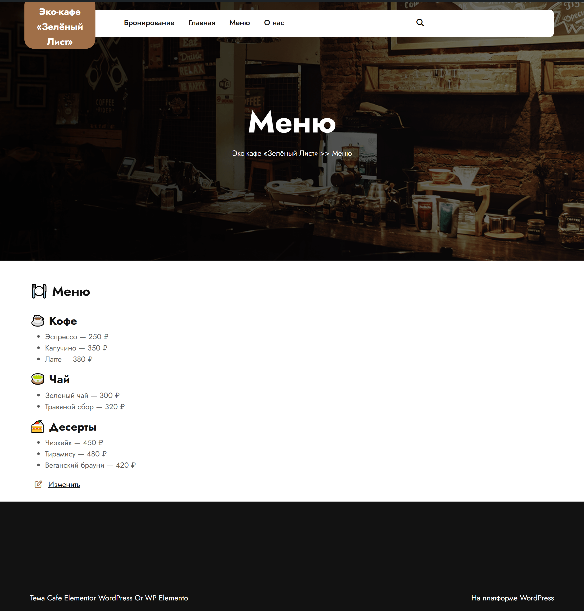
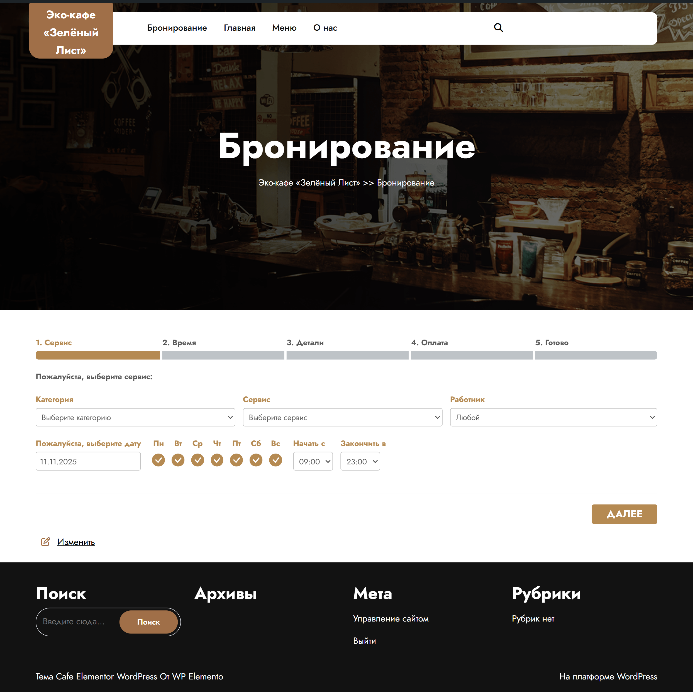

# 🌿 Эко-кафе "Зелёный лист" — Дипломная работа

Сайт кафе, созданный на WordPress в рамках дипломной работы.  
Проект демонстрирует навыки веб-разработки, работы с CMS, адаптивного дизайна и интеграции популярных плагинов.

---

## 📄 Содержимое сайта

- **Главная страница** — тема [Cafe Elementor](https://elementor.com/)
- **Меню** — кастомные страницы
- **Бронирование** — плагин [Bookly](https://www.booking-wp-plugin.com/)
- **О нас** — форма обратной связи через [Kali Forms](https://kaliforms.com/)

- **Адаптивный дизайн** — корректное отображение на всех устройствах

---

## ⚙️ Установка проекта

1. Скопируйте файлы в папку `htdocs` (если используете XAMPP)
2. Импортируйте базу данных через `phpMyAdmin`
3. Обновите файл `wp-config.php` с вашими данными доступа к БД
4. Убедитесь, что `.env` и другие чувствительные файлы не попали в репозиторий

---

## 🔐 Безопасность

- `.gitignore` настроен для исключения:
  - `.env`, `wp-config.php`, `uploads/`, `vendor/`, `node_modules/`, `*.log`, `*.sql`
- Репозиторий очищен от чувствительных и временных файлов
- Используется GitHub для версионности и хранения кода

---

## 📸 Скриншоты

| Десктоп | Мобильная версия |
|--------|------------------|
|  |  |
|  |  |

> Скриншоты находятся в папке `screenshots/`

---

## 🚀 Деплой

Проект может быть размещён:
- вручную через FTP или панель хостинга
- автоматически через GitHub Actions (при наличии SSH или Git-доступа)

---

## 👨‍💻 Автор

**Михаил Скуратов**  
Краснодар, 2025  
[GitHub профайл](https://github.com/aqatezumr)

---

## 📄 Лицензия

Проект распространяется под лицензией MIT. Подробнее — в файле [`LICENSE`](LICENSE).

